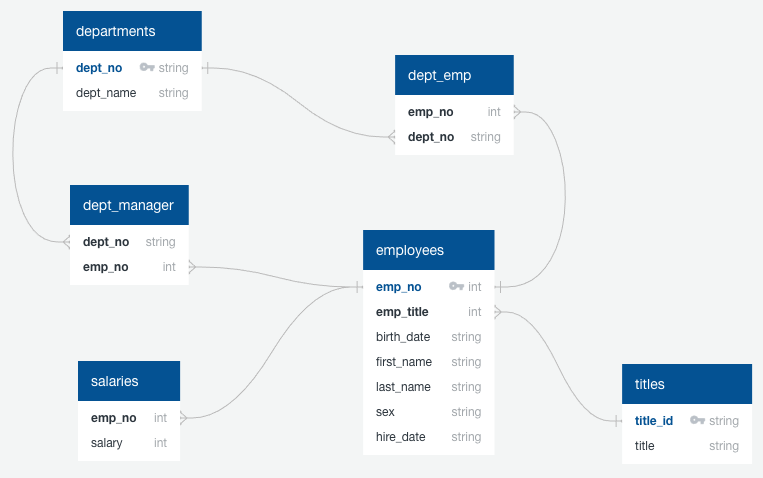
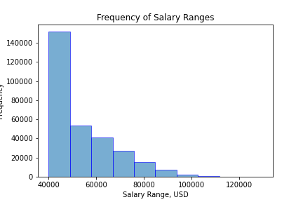
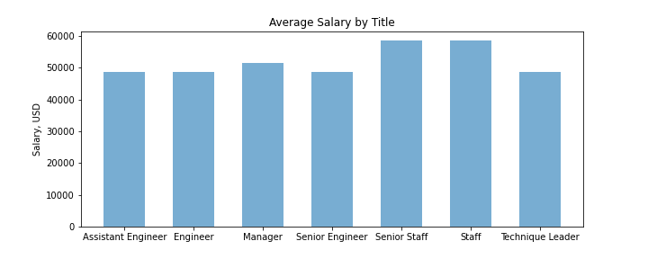

# SQL Challenge

## Overview

The purpose of this assignment is to use pgAdmin to create PostgreSQL database tables from a set of CSV files, then create queries to extract some information from them. The bonus is to use SQLAlchemy, Jupyter Notebook, Pandas, and Matplotlib to visualize the potentially suspect data.

## Schemas

First, I used [Quick Database Diagrams](http://www.quickdatabasediagrams.com) to generate an ERD to map out the relationships between the various primary/foreign keys in the tables:



Which provided a handy cheat sheet for creating schemas and queries. For instance, that `employees` table looks like this in Postgres:

```
CREATE TABLE employees (
	emp_no VARCHAR NOT NULL PRIMARY KEY,
	emp_title VARCHAR NOT NULL,
	birth_date VARCHAR NOT NULL,
	first_name VARCHAR NOT NULL,
	last_name VARCHAR NOT NULL,
	sex VARCHAR NOT NULL,
	hire_date VARCHAR NOT NULL
);
```

Once I created the tables, I used pgAdmin to import the CSV files into each table.

## Queries

There were 8 queries in this assignment, all using `JOIN` statements to link between the tables. Many of them involved joining 3 tables: `employees`, a join table (such as `dept_manager`), and a table that links an ID to a name or value (such as `departments`). Here's one example:

```
SELECT
	e.emp_no,
	e.last_name,
	e.first_name,
	d.dept_name
FROM employees AS e
JOIN dept_emp AS de
  ON e.emp_no = de.emp_no
JOIN departments AS d
  ON de.dept_no = d.dept_no
WHERE d.dept_name = 'Sales'
  OR d.dept_name = 'Development';
```

There's also some use of `WHERE` to filter data:

```
SELECT
	first_name,
	last_name,
	hire_date
FROM employees
WHERE EXTRACT(YEAR FROM CAST(hire_date AS DATE)) = 1986;
```

And `GROUP BY` to get some counts:

```
SELECT
	last_name,
	COUNT (last_name) AS frequency
FROM employees
GROUP BY last_name
ORDER BY frequency DESC;
```

## Bonus

Having explored the data in pgAdmin, the final step was to extract some more meaning from this table containing 300,000 employees using data visualizations, the premise being it may be a fake dataset.

First, in Jupyter Notebook, I used SQLAlchemy to query the data and put it into Pandas DataFrames. With that in hand, I used Matplotlib to create a histogram of employee salary ranges:



So far, not particularly suspect. (If most employees made upwards of $100,000, I'd be a little more concerned.) The real tell was average salary by title:



As you can see, senior engineers make the same amount as mid-level and assistant engineers. That doesn't seem right. Finally, my fictional boss coyly tells me I should look myself up by employee ID, and it turns out my name is April Foolsday. Ha.